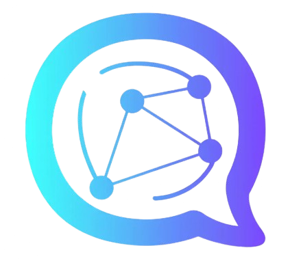
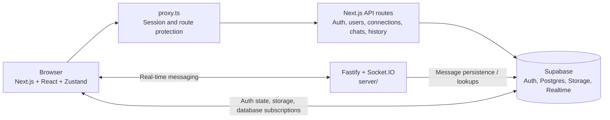

<p align="center">
  
</p>

<h1 align="center">WebChat</h1>

<p align="center">
  A modern, connection-based chat app built with Next.js, Supabase, and Socket.IO.
</p>

<p align="center">
  
  
  
  
  
  
</p>

> 🚧 **Work in progress.** Authentication, connections, profiles, and the core 1:1 messaging workflow are implemented. Read receipts, typing indicators, online presence, chat filters, and other messaging features are still in progress. See the [roadmap](#roadmap) for details.

## Table of contents

- [Overview](#overview)
- [Roadmap](#roadmap)
- [Tech stack](#tech-stack)
- [Project structure](#project-structure)
- [Architecture](#architecture)
- [API routes](#api-routes)
- [Real-time communication](#real-time-communication)
- [Data model](#data-model)
- [Getting started](#getting-started)
- [Contributing](#contributing)

## Overview

WebChat is a connection-based messaging app. Users discover people by username or phone number, send a connection request, and can communicate after the request is accepted. The interface uses a dark theme with gradient accents, a sidebar, a chat list, a chat window, and a user-information panel.

**Working today**

- Email-verified sign-up with OTP, login, logout, session restoration, and protected routes
- Find users and send, accept, reject, or cancel connection requests
- Search accepted connections
- Profile page with editable name, bio, and avatar management
- 1:1 text messaging with persisted messages
- Paginated message history, including loading older messages when scrolling
- Supabase Realtime subscriptions for message and chat-list updates
- Chat list containing accepted connections, latest-message previews, and timestamps
- Date separators generated from message timestamps
- User details panel and message input interface

Unread counts are returned by the chat-list query, but the unread badge still needs end-to-end verification. Message delivery/read receipts, typing indicators, and online presence are not complete yet.

## Roadmap

This README doubles as the project's progress tracker. Update the relevant checklist in the same change that completes a feature.

`[x]` completed · `[ ]` pending

### At a glance

| Phase | Focus | Status |
|:-----:|-------|--------|
| 1 | Authentication & session | ✅ Done |
| 2 | Connections | ✅ Done |
| 3 | Profile | ✅ Done |
| 4 | Chat UI shell | ✅ Done |
| 5 | Real-time 1:1 messaging | 🚧 In progress |
| 6 | Media & attachments | ⏳ Planned |
| 7 | Starred & message actions | ⏳ Planned |
| 8 | Groups | ⏳ Planned |
| 9 | Account, privacy & settings | ⏳ Planned |
| 10 | Quality, security & deployment | ⏳ Planned |

### Phase 1 — Authentication & session ✅

- [x] Sign up with full name, username, email, phone number, and password
- [x] Password confirmation and show/hide password controls
- [x] Server-side validation and normalization of registration input
- [x] Duplicate-account checks during registration
- [x] Email verification with OTP and resend cooldown
- [x] Signed, `httpOnly`, short-lived verification cookie that gates `/verify-email`
- [x] Login with email and password
- [x] Logout through a server-side sign-out
- [x] Route protection in `proxy.ts`
- [x] `AuthProvider` restores the session and loads the user's profile into Zustand

### Phase 2 — Connections ✅

- [x] Find people by username or phone number
- [x] Debounced, cancellable user search with connection status
- [x] Send connection requests with self-request and duplicate-request protections
- [x] Requests panel with received and sent lists
- [x] Accept, reject, and cancel requests
- [x] Live pending-request badge through Supabase Realtime
- [x] Search within accepted connections, including per-contact custom names where supported
- [x] Contact details endpoint restricted to connected users

### Phase 3 — Profile ✅

- [x] Profile view with avatar, name, username, email, phone, bio, and join date
- [x] Edit full name and bio
- [x] Upload profile photos to Supabase Storage with file validation
- [x] Remove profile photos and use initials as the fallback avatar
- [x] Success and error toast notifications

### Phase 4 — Chat UI shell ✅

- [x] Sidebar navigation for Chats, Groups, Starred, Requests, Settings, and Profile
- [x] Chat list panel with search, filter chips, and chat-item layout
- [x] New Chat panel for finding people and sending connection requests
- [x] Chat window with welcome screen, header, message bubbles, and message input
- [x] User information panel with profile and connection details
- [x] Loading skeletons, empty states, and retry-on-error states

### Phase 5 — Real-time 1:1 messaging 🚧

- [x] Database schema for conversations and messages, with Row Level Security
- [x] Send and receive text messages between connected users
- [x] Real-time message updates through the messaging/Realtime integration
- [x] Message history with pagination and load-older-on-scroll behavior
- [x] Chat list for accepted connections with latest-message preview and timestamp
- [ ] Verify unread counts and unread badge updates end to end
- [x] Day separators based on real message dates
- [x] Sent / delivered / read receipts
- [x] Smart chat auto-scrolling, preserved reading position, and new message scroll button
- [x] Typing indicators
- [x] Online / offline presence
- [ ] Working **Unread** and **Online** filters
- [ ] Clear chat

### Phase 6 — Media & attachments ⏳

- [ ] Attach button for images, documents, and other files
- [ ] Supabase Storage setup and access policies for chat media
- [ ] Inline image previews and file downloads
- [ ] **Media, Docs and Links** gallery in the User Info panel, with live counts
- [ ] Link detection in messages

### Phase 7 — Starred & message actions ⏳

- [ ] Star and unstar messages
- [ ] **Starred** tab and starred count in the User Info panel
- [ ] Reply to a message
- [ ] Edit and delete messages (for me / for everyone)
- [ ] Copy and forward messages

### Phase 8 — Groups ⏳

- [ ] Create a group with a name, photo, and members selected from connections
- [ ] Real-time group messaging
- [ ] Group information panel with member roles (admin / member)
- [ ] Add and remove members; leave a group
- [ ] **Groups** tab and **Groups** chat filter
- [ ] Groups-in-common count in the User Info panel

### Phase 9 — Account, privacy & settings ⏳

- [ ] Forgot / reset password flow
- [ ] Working **Remember me** behavior
- [ ] Google sign-in
- [ ] UI for contact nicknames using the existing `custom_name` field
- [ ] Block and unblock users
- [ ] Remove a connection
- [ ] Account, privacy, and notification settings
- [ ] In-app and browser notifications, including unread count in the tab title

### Phase 10 — Quality, security & deployment ⏳

- [ ] Audit migrations so a fresh Supabase project can be provisioned from the repository
- [ ] Username availability check during sign-up
- [ ] Validate and normalize phone numbers (E.164)
- [ ] Rate limiting on auth and search endpoints
- [ ] Schema-based request validation in API routes (for example, Zod)
- [ ] Display user-load errors in the chat window
- [ ] Replace placeholder entries in the chat-list options menu
- [ ] UI cleanup: consistent initials fallback, profile-label cleanup, and rename `OptInput.tsx` to `OtpInput.tsx`
- [ ] Responsive / mobile layout
- [ ] Accessibility pass: labels, focus states, and keyboard navigation
- [ ] Automated unit and end-to-end tests plus CI (lint, type-check, build)
- [ ] Add `LICENSE` and `CONTRIBUTING.md`
- [ ] Production deployment and environment documentation

### Backlog — ideas, unscheduled

Voice messages · voice and video calls (WebRTC) · end-to-end encryption · message search · light theme · installable PWA · emoji reactions · disappearing messages

## Tech stack

| Layer | Technology |
|-------|------------|
| Frontend framework | Next.js App Router |
| Language | TypeScript |
| Styling | Tailwind CSS |
| HTTP backend | Next.js Route Handlers |
| Real-time server | Node.js, Fastify, Socket.IO (separate `server/` directory) |
| Database | Supabase Postgres |
| Authentication | Supabase Auth, `@supabase/ssr` |
| File storage | Supabase Storage |
| Database change subscriptions | Supabase Realtime |
| Client state | Zustand |
| UI libraries | `lucide-react`, `react-hot-toast`, `input-otp` |
| Package manager | pnpm |

## Project structure

The frontend and the real-time server are maintained separately:

```text
webchat/
├── frontend/
│   ├── app/
│   │   ├── api/                 # Next.js Route Handlers
│   │   ├── components/          # Chat, profile, and shared UI
│   │   └── ...
│   ├── lib/
│   │   ├── store/               # Zustand stores
│   │   └── supabase/            # Supabase browser/server clients
│   └── ...
├── server/
│   ├── .env.example             # Real-time server environment template
│   ├── package.json              # Server scripts and dependencies
│   └── src/
│       ├── server.ts             # Fastify and Socket.IO entry point
│       ├── config/env.ts         # Environment loading and validation
│       ├── lib/
│       │   ├── supabase.ts       # Authenticated Supabase client
│       │   └── socket/           # Socket rate limiting and room helpers
│       ├── schemas/              # Message input validation schemas
│       ├── services/             # Message persistence/service logic
│       └── sockets/              # Socket.IO event handlers
├── supabase/
│   └── migrations/              # Database schema, policies, and migrations
└── README.md
```

This is a high-level view; individual folders may contain additional files.

## Architecture



- **Next.js API routes** handle authenticated HTTP operations such as user lookups, connection management, chat-list retrieval, and paginated message history.
- **Fastify + Socket.IO** runs in the separate `server/` directory and provides the real-time messaging transport.
- **Supabase** provides authentication, Postgres persistence, profile/avatar storage, Row Level Security, and database change subscriptions.
- **`proxy.ts`** checks the authentication session and applies route redirects.
- **Zustand** manages client-side chat state, the current user, active navigation, and messaging state.

## API routes

The following routes are implemented in the Next.js frontend. All routes marked **Yes** require an authenticated session.

| Route | Method | Auth required | Description |
|-------|--------|:-------------:|-------------|
| `/api/auth/register` | POST | No | Register an account and initiate email verification |
| `/api/auth/login` | POST | No | Sign in with email and password |
| `/api/auth/logout` | POST | Yes | Sign out and clear the session |
| `/api/auth/clear-cookie` | POST | No | Clear the email-verification cookie |
| `/api/users/search?q=` | GET | Yes | Search users and return their connection status |
| `/api/users/connected-search?q=` | GET | Yes | Search within accepted connections |
| `/api/users/[id]` | GET | Yes | Retrieve details for a connected user |
| `/api/connections/requests` | GET | Yes | List received and sent pending requests |
| `/api/connections/requests` | POST | Yes | Send a connection request |
| `/api/connections/[id]` | PATCH | Yes | Accept, reject, or cancel a connection request |
| `/api/chats` | GET | Yes | Load accepted connections, latest-message previews, timestamps, and unread counts |
| `/api/messages?userId=&limit=&before=` | GET | Yes | Load paginated 1:1 message history; `before` is used to load older messages |

The real-time server's event handlers are implemented separately under `server/src`. Keep its event names and payloads documented alongside the server code when that contract stabilizes; do not treat Socket.IO events as Next.js API routes.

## Real-time communication

WebChat uses both Socket.IO and Supabase Realtime for live behavior. Socket.IO provides the application's real-time messaging connection, while Supabase Realtime subscriptions notify the client about relevant database changes, including message and connection updates.

- Message history is loaded through the authenticated `/api/messages` endpoint.
- Older history is requested with a cursor when the user scrolls to the top of the chat window.
- The chat list is loaded through `/api/chats` and includes accepted connections even when there is no message preview yet.
- Message changes trigger chat-list refreshes so previews and timestamps can stay current.
- Unread counts are calculated by the chat-list query; unread badge behavior still requires end-to-end verification.

## Data model

The application uses these primary tables and storage resources:

- **`profiles`**: profile data linked to the Supabase Auth user, including `id`, `full_name`, `username`, `email`, `phone_number`, `avatar_url`, `bio`, and timestamps.
- **`connections`**: `id`, `user_id` (requester), `contact_id` (recipient), `status` (`pending` or `accepted`), `custom_name`, and `created_at`.
- **`conversations`**: `id`, `user_one_id`, `user_two_id`, `created_at`, and `updated_at`. A conversation represents a 1:1 pair of users.
- **`messages`**: `id`, `conversation_id`, `sender_id`, `receiver_id`, `content`, `is_read`, and `created_at`. Stores persisted messages and the current read state.
- **Supabase Storage**: the `avatars` bucket stores profile photos. Chat-media storage is planned.
- **Supabase Realtime**: subscriptions support live connection-request and messaging/chat-list updates.

Row Level Security and database grants should restrict rows to the relevant users. Apply and test migrations against a development project before deploying database changes.

## Getting started

### Prerequisites

- Node.js 20 or later
- [pnpm](https://pnpm.io/installation)
- A [Supabase](https://supabase.com) project
- Supabase CLI access for applying the repository migrations

### 1. Clone the repository

```bash
git clone https://github.com/<your-username>/webchat.git
cd webchat
```

Replace `<your-username>` with the repository owner's GitHub username or use your repository's actual clone URL.

### 2. Install frontend dependencies

```bash
cd frontend
pnpm install
```

Create `frontend/.env.local` and provide the Supabase settings expected by the frontend code. The current helpers use the following names:

```env
NEXT_PUBLIC_SUPABASE_URL=<your-supabase-project-url>
NEXT_PUBLIC_SUPABASE_ANON_KEY=<your-supabase-anon-key>
VERIFICATION_COOKIE_SECRET=<long-random-secret>
```

Generate a strong cookie secret, for example with:

```bash
openssl rand -base64 32
```

Never commit `.env.local` or expose server-only secrets in `NEXT_PUBLIC_` variables.

### 3. Configure and run the real-time server

The real-time backend is a separate Node.js application in `server/`. It uses Fastify and Socket.IO and must be running in its own terminal while developing the frontend.

Install its dependencies and create a local environment file. In PowerShell, from the repository root:

```powershell
cd server
pnpm install
Copy-Item .env.example .env
```

If your template is currently named `env.example` without the leading dot, use `Copy-Item env.example .env` instead. Keep the example file committed, but do not commit your populated `.env` file.

Edit `server/.env` and fill in the values. For local development, the settings normally look like this:

```env
PORT=4000
FRONTEND_URL=http://localhost:3000
SUPABASE_URL=https://<your-project-ref>.supabase.co
SUPABASE_PUBLISHABLE_KEY=<your-supabase-publishable-key>
```

- `PORT`: the port the Fastify/Socket.IO server listens on. The example uses `4000`; keep this consistent with the server configuration and any frontend Socket.IO URL.
- `FRONTEND_URL`: the exact frontend origin allowed by the server's CORS configuration. For local development, use `http://localhost:3000`.
- `SUPABASE_URL`: your Supabase project URL.
- `SUPABASE_PUBLISHABLE_KEY`: the project's publishable key (or the anon key if that is what the project currently uses). The server uses the authenticated user's access token for user-scoped operations. Do **not** put a Supabase service-role key in this variable or expose one to the frontend.

Start the server from the `server/` directory in **Terminal 1**:

```powershell
pnpm dev
```

If `pnpm dev` is not defined in the current `server/package.json`, run `pnpm run` to list the available scripts and use the server's development script. Keep this terminal running.

### 4. Set up Supabase

1. Link the Supabase CLI to your development project using the project's CLI configuration.
2. Review the pending migrations and apply them from the repository root:

   ```bash
   pnpm supabase db push
   ```

3. Verify that the required tables, profile-creation trigger, Row Level Security policies, and grants are present.
4. Create the public `avatars` Storage bucket and configure its access policies to match the application's upload and removal behavior.
5. In Supabase Authentication settings, keep email confirmation enabled and configure the signup email template for the verification code used by the app.
6. Confirm that the `messages` and `connections` tables are included in the Realtime publication when required by the subscriptions.

Review the SQL plan and target project before applying migrations. Do not run development migrations against production without a backup and review.

### 5. Run the frontend

Open a **second terminal** from the repository root and run:

```powershell
cd frontend
pnpm run dev
```

Open [http://localhost:3000](http://localhost:3000). Keep both the frontend terminal and the `server/` terminal running. The Next.js app serves the UI and HTTP API routes; the separate Fastify/Socket.IO process handles real-time socket events.

### 6. Check the frontend types

From the `frontend/` directory:

```powershell
pnpm exec tsc --noEmit
```

### 7. Check the server scripts and types

From the `server/` directory, list the scripts that are available in this checkout:

```powershell
pnpm run dev
```

If the server package defines a type-check script, run that script as well. Use the server's own scripts for building and starting it; the frontend and server are separate packages.

## Contributing

WebChat is under active development. Pick a pending item from the [roadmap](#roadmap), keep changes focused, and update this README when a feature ships. Before opening a pull request, run the relevant type checks and test the feature with authenticated users in a development Supabase project.
