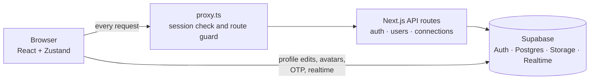

<p align="center">
  
</p>

<h1 align="center">WebChat</h1>

<p align="center">
  A modern, connection-based chat app built with Next.js and Supabase.
</p>

<p align="center">
  
  
  
  
  
</p>

> 🚧 **Work in progress.** Authentication, connections and profiles are done. Real-time messaging is the next milestone. See the [roadmap](#roadmap) for what is finished and what is coming.

## Table of contents

- [Overview](#overview)
- [Roadmap](#roadmap)
- [Tech stack](#tech-stack)
- [Architecture](#architecture)
- [API routes](#api-routes)
- [Data model](#data-model)
- [Getting started](#getting-started)
- [Contributing](#contributing)

## Overview

WebChat is built around **connections**: you find people by username or phone number, send a connection request, and once it is accepted you can see their details and, once messaging ships, chat with them. The app uses a dark, gradient-accented UI with a sidebar, a context panel and a chat window.

**Working today**

- Email-verified sign-up (6-digit OTP), login, logout and protected routes
- Find people, then send, accept, decline and cancel connection requests, with a live request badge
- Profile page with editable name, bio and avatar upload
- Chat UI shell (chat list, chat window, user info panel), not yet wired to messages

## Roadmap

This README doubles as the project's progress tracker, and items are ticked as they ship.

`[x]` completed · `[ ]` pending

### At a glance

| Phase | Focus | Status |
|:-----:|-------|--------|
| 1 | Authentication & session | ✅ Done |
| 2 | Connections | ✅ Done |
| 3 | Profile | ✅ Done |
| 4 | Chat UI shell | ✅ Done (UI only) |
| 5 | Real-time 1:1 messaging | 🎯 Next |
| 6 | Media & attachments | ⏳ Planned |
| 7 | Starred & message actions | ⏳ Planned |
| 8 | Groups | ⏳ Planned |
| 9 | Account, privacy & settings | ⏳ Planned |
| 10 | Quality, security & deployment | ⏳ Planned |

### Phase 1 — Authentication & session ✅

- [x] Sign up with full name, username, email, phone number and password (confirm-password and show/hide toggles)
- [x] Server-side validation and normalization: required fields, minimum 8-character password, trimmed lower-case email, normalized username
- [x] Duplicate-account detection on sign-up
- [x] Email verification with a 6-digit OTP (`input-otp`) and a 60-second resend cooldown
- [x] Signed, `httpOnly`, 10-minute verification cookie (HMAC-SHA256) that gates the `/verify-email` page
- [x] Login with email and password, and logout through a server-side sign-out
- [x] Route protection in `proxy.ts`: guests are sent to `/login`, signed-in users are kept off the auth pages
- [x] `AuthProvider` restores the session on load and stores the user's profile in the Zustand store

### Phase 2 — Connections ✅

- [x] Find people by username or phone number (debounced, cancellable search that also reports each result's connection status)
- [x] Send connection requests, validated and protected against self-requests and duplicates in either direction
- [x] Requests tab with **Received** and **Sent** lists, counts and relative timestamps
- [x] Accept, decline and cancel requests
- [x] Live pending-request badge on the sidebar (Supabase Realtime)
- [x] Search within your accepted connections (supports per-contact custom names)
- [x] Contact details endpoint that only responds for connected users

### Phase 3 — Profile ✅

- [x] "My Profile" view with avatar, name, username, email, phone, bio and join date
- [x] Edit full name and bio (100-character limit)
- [x] Upload a profile photo: images only, up to 5 MB, stored in Supabase Storage with cleanup of the old file and rollback on failure
- [x] Remove the profile photo through a confirmation modal (initials are shown as the fallback)
- [x] Success and error toasts

### Phase 4 — Chat UI shell ✅ (UI only)

- [x] Sidebar navigation (Chats, Groups, Starred, Requests, Settings) plus a profile shortcut
- [x] Chat list panel with search, filter chips, chat-item layout with unread badge, and a **New Chat** panel for finding people
- [x] Chat window with welcome screen, header (avatar and status), message bubbles and the message input bar
- [x] User Info panel with bio, email, phone, connection date and contact actions
- [x] Loading skeletons, empty states and retry-on-error states

### Phase 5 — Real-time 1:1 messaging 🎯 (next)

- [x] Database schema for conversations and messages, with Row Level Security
- [x] Send and receive text messages between connected users
- [ ] Real-time delivery with Supabase Realtime
- [ ] Message history with pagination (load older messages on scroll)
- [ ] Real chat list: accepted connections with last message, time and unread count _(today the list stays empty until you search)_
- [ ] Day separators from real message dates _(replaces the hard-coded date chip)_
- [ ] Sent / delivered / read receipts
- [ ] Typing indicators
- [ ] Online / offline presence _(currently always shown as "Offline")_
- [ ] Working **Unread** and **Online** filters
- [ ] Clear chat

### Phase 6 — Media & attachments ⏳

- [ ] Attach button for images, documents and other files (Supabase Storage bucket for chat media)
- [ ] Inline image previews and file downloads in the chat
- [ ] **Media, Docs and Links** gallery in the User Info panel, with live counts
- [ ] Link detection in messages

### Phase 7 — Starred & message actions ⏳

- [ ] Star and unstar messages
- [ ] **Starred** tab, plus the starred count in the User Info panel
- [ ] Reply to a message
- [ ] Edit and delete messages (for me / for everyone)
- [ ] Copy and forward messages

### Phase 8 — Groups ⏳

- [ ] Create a group with a name, photo and members picked from your connections
- [ ] Real-time group messaging
- [ ] Group info panel with members and roles (admin / member)
- [ ] Add and remove members, leave a group
- [ ] **Groups** tab and **Groups** chat filter
- [ ] "Groups in common" count in the User Info panel

### Phase 9 — Account, privacy & settings ⏳

- [ ] Forgot / reset password _(link exists, flow not built)_
- [ ] "Remember me" _(checkbox is UI only)_
- [ ] Sign in with Google _(button is UI only)_
- [ ] Contact nicknames: UI for the existing `custom_name` field
- [ ] Block and unblock users
- [ ] Delete contact (remove a connection)
- [ ] Settings beyond Edit Profile: account, privacy and notifications
- [ ] Notifications: in-app, browser and unread count in the tab title

### Phase 10 — Quality, security & deployment ⏳

- [ ] Commit the SQL schema, triggers and RLS policies to the repo (e.g. `supabase/migrations`)
- [ ] Username availability check on sign-up
- [ ] Validate and normalize phone numbers (E.164) so phone search is reliable
- [ ] Rate limiting on auth and search endpoints
- [ ] Schema-based request validation in API routes (e.g. Zod)
- [ ] Show user-load errors in the chat window _(currently stored but never displayed)_
- [ ] Replace the placeholder entries in the chat-list options menu _(three duplicate "Logout" items)_
- [ ] UI clean-up: consistent initials fallback for avatars, relabel "Connected Since" on the profile page to "Joined", rename `OptInput.tsx` to `OtpInput.tsx`
- [ ] Responsive / mobile layout
- [ ] Accessibility pass: labels, focus states, keyboard navigation
- [ ] Automated tests (unit + end-to-end) and a CI workflow (lint, type-check, build)
- [ ] `LICENSE` and `CONTRIBUTING.md`
- [ ] Production deployment (e.g. Vercel with `frontend/` as the root directory) and environment documentation

### Backlog (ideas, unscheduled)

Voice messages · voice and video calls (WebRTC) · end-to-end encryption · message search · light theme · installable PWA · emoji reactions · disappearing messages

## Tech stack

| Layer | Technology |
|-------|------------|
| Framework | [Next.js](https://nextjs.org) (App Router) |
| Language | TypeScript |
| Styling | Tailwind CSS |
| Backend | [Supabase](https://supabase.com): Auth, Postgres, Storage and Realtime via `@supabase/ssr` |
| State management | Zustand |
| UI libraries | `lucide-react`, `react-hot-toast`, `input-otp` |
| Package manager | pnpm |

## Architecture



- **API routes** handle auth, user lookups and connection requests using the server-side Supabase client and the cookie session.
- **Browser client** talks to Supabase directly for profile edits, avatar storage, OTP verification and resend, the auth-state listener and the Realtime badge.
- **`proxy.ts`** (Next.js's successor to `middleware.ts`) validates the session with `getClaims()`, refreshes the session cookies and redirects based on auth state.
- **Email verification** is protected by a signed, short-lived cookie: only someone who just registered can open `/verify-email`, and only for the email they registered with.
- **Layout:** sidebar rail → 320 px side panel (chat list, requests, settings or profile) → chat window → optional user-info panel.
- **Client state** (Zustand): active tab, current user, and a flag that opens the "New Chat" panel.

## API routes

| Route | Method | Auth required | Description |
|-------|--------|:-------------:|-------------|
| `/api/auth/register` | POST | No | Create an account and set the verification cookie |
| `/api/auth/login` | POST | No | Sign in with email and password |
| `/api/auth/logout` | POST | No | Sign out |
| `/api/auth/clear-cookie` | POST | No | Clear the `email_verification` cookie |
| `/api/users/search?q=` | GET | Yes | Search all users by username or phone, including connection status |
| `/api/users/connected-search?q=` | GET | Yes | Search within accepted connections |
| `/api/users/[id]` | GET | Yes | Details of a connected user |
| `/api/connections/requests` | GET | Yes | List received and sent pending requests |
| `/api/connections/requests` | POST | Yes | Send a connection request |
| `/api/connections/[id]` | PATCH | Yes | `accept`, `reject` or `cancel` a request |

## Data model

As used by the code today:

- **`profiles`**: `id` (matches the auth user id), `full_name`, `username`, `email`, `phone_number`, `avatar_url`, `bio`, `created_at`, `updated_at`
- **`connections`**: `id`, `user_id` (requester), `contact_id` (recipient), `status` (`pending` or `accepted`), `custom_name` (requester's nickname for the contact), `created_at`
- **Storage**: public `avatars` bucket, files stored as `<userId>/avatar-<timestamp>.<ext>`
- **Realtime**: enabled on `connections` (drives the pending-request badge)

## Getting started

### Prerequisites

- Node.js 20 or later
- [pnpm](https://pnpm.io/installation) (use pnpm rather than npm or yarn so the lockfile stays consistent)
- A [Supabase](https://supabase.com) project

### 1. Clone and install

```bash
git clone https://github.com/<your-username>/webchat.git
cd webchat/frontend
pnpm install
```

### 2. Configure environment variables

Create a `.env.local` file in the `frontend/` folder:

```env
NEXT_PUBLIC_SUPABASE_URL=<your-supabase-project-url>
NEXT_PUBLIC_SUPABASE_PUBLISHABLE_KEY=<your-supabase-anon-or-publishable-key>
VERIFICATION_COOKIE_SECRET=<long-random-string>
```

Generate the secret with `openssl rand -base64 32`.

### 3. Set up Supabase

1. Create the `profiles` and `connections` tables (see [Data model](#data-model)), plus a trigger that creates a `profiles` row from the sign-up metadata (`full_name`, `username`, `phone_number`) and the user's email.
2. Create a **public** Storage bucket named `avatars`.
3. Enable Realtime for the `connections` table.
4. In your Supabase **Authentication** settings, keep email confirmation on and edit the *Confirm signup* email template to send the 6-digit code (`{{ .Token }}`) instead of a link.
5. Turn on Row Level Security for both tables and add policies. The SQL will be committed to the repo (see [Phase 10](#roadmap)).

### 4. Run the app

```bash
pnpm run dev
```

Open <http://localhost:3000>.

## Contributing

WebChat is under active development. To contribute, pick a pending item from the [roadmap](#roadmap), open an issue to discuss it, then send a pull request. When a feature ships, tick its checkbox in this README as part of the same PR.